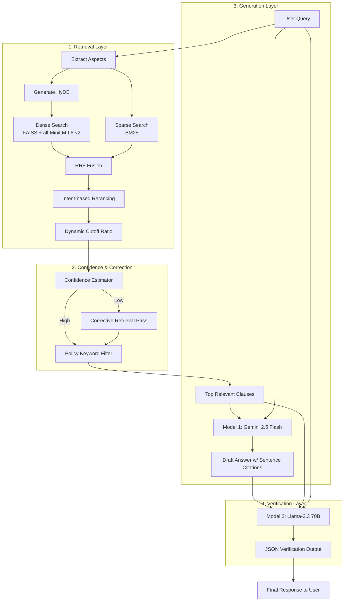

# LIRAG v2 Policy Agent

LIRAG (Layered Retrieval-Augmented Generation) is a state-of-the-art policy QA pipeline for complex government schemes.

It features a robust 6-stage pipeline designed for high precision in legal and administrative domains:
1. **Multi-Aspect Hybrid Retrieval**: Dense (FAISS) + Sparse (BM25) + HyDE + RRF fusion
2. **Confidence Estimation**: Multi-signal confidence scoring
3. **Corrective Retrieval**: Autonomous fallback passes for low-confidence queries
4. **Policy-Aware Filtering**: Intent-based semantic reranking and dynamic score cutoffs
5. **Evidence-Constrained Generation**: LLM generation with strict sentence-level clause citations
6. **Answer Verification**: Dual-LLM architecture for hallucination guarding

## 1. End-to-End Flow

Full process from raw PDFs to evaluated answers:

1. Put policy PDFs into `data/raw_policies/`.
2. Extract text from PDFs to `data/processed_clauses/*.txt`.
3. Segment text into clauses and save to `data/clauses.json`.
4. Build retrieval indexes:
	 - sparse + dense under `data/index/` (from `data/clauses.json`)
	 - dense index under `data/processed_clauses/dense_index` (from `data/processed_clauses/clauses.json`)
5. Run the policy agent.
6. Run evaluations.

Important:
- Runtime retrieval in `src/agent.py` currently uses `data/processed_clauses/clauses.json` and `data/processed_clauses/dense_index` via `dense_search.py` and `sparse_search.py`.
- `build_index.py` builds `data/index/*` from `data/clauses.json`.
- Keep these datasets synchronized after rebuilds.

## 2. Technology Stack & Theoretical Concepts

LIRAG v2 is built upon several advanced retrieval and generation paradigms to ensure strict factual accuracy:

### Core Technologies
*   **Python 3.10+**: Core programming language.
*   **FAISS (Facebook AI Similarity Search)**: Vector database used for ultra-fast dense similarity search.
*   **SentenceTransformers (`all-MiniLM-L6-v2`)**: Embedding model used to convert policy text and queries into dense vectors.
*   **Google Generative AI (`gemini-2.5-flash`)**: Primary LLM used for synthesizing evidence-constrained answers with sentence-level citations.
*   **Meta Llama 3 (`llama-3.3-70b-versatile`) via Groq**: Secondary LLM acting as a strict, high-speed hallucination verifier.

### Theoretical Concepts
*   **Hybrid Search**: Combining Dense Retrieval (Semantic matching via FAISS/Embeddings) and Sparse Retrieval (Keyword matching via BM25) to capture both the *meaning* and the *exact terminology* of a query.
*   **Reciprocal Rank Fusion (RRF)**: An algorithm that mathematically fuses the ranked lists from the dense and sparse retrievers, ensuring that clauses appearing highly in both lists are boosted to the top.
*   **Hypothetical Document Embeddings (HyDE)**: An advanced retrieval technique where an LLM generates a "fake" hypothetical answer to the query first, and this hypothetical answer is embedded to search the vector space, bridging the vocabulary gap between short queries and long policy documents.
*   **Retrieval-Augmented Generation (RAG)**: The overarching architecture where an LLM is constrained to answer *only* using the provided retrieved context, preventing it from relying on its internal, potentially outdated or hallucinated knowledge.
*   **Confidence Estimation & Corrective Retrieval (CRAG)**: The system mathematically scores its retrieval confidence based on top score, score gaps, and keyword overlap. If confidence is low, it triggers a "corrective" fallback retrieval pass before attempting generation.
*   **Dual-LLM Verification**: Using a smaller, faster model (Gemini Flash) for drafting the response, and a larger, stricter model (Llama 70B) solely for auditing the draft against the source text to block hallucinations.

## 3. System Architecture

The pipeline follows a robust 6-stage process: **Retrieval → Confidence → Correction → Filtering → Generation → Verification**. 



### What Does Each Model Do?

The system utilizes three distinct AI models, each with a specialized role:

**Model 1: The Retriever (`all-MiniLM-L6-v2`)**
*   **Provider:** HuggingFace / SentenceTransformers
*   **Role:** Converts text into numerical vectors (embeddings).
*   **Function:** Powers the "Dense Search" and semantic reranking. It converts the question and HyDE document into vectors to find the closest matching policy clauses.

**Model 2: The Generator (`gemini-2.5-flash`)**
*   **Provider:** Google Generative AI
*   **Role:** Drafts the initial human-readable answer.
*   **Function:** It takes the user's question and the raw text of the top retrieved policy clauses. It synthesizes a fluent answer and explicitly cites the source clause ID for *every single sentence* it generates.

**Model 3: The Verifier (`llama-3.3-70b-versatile`)**
*   **Provider:** Meta (hosted via Groq API)
*   **Role:** Strict auditor and hallucination guardrail.
*   **Function:** It compares the Draft Answer (from Gemini) against the Original Clauses. If Gemini hallucinated or included outside information, Llama rewrites the answer to be strictly grounded. It outputs structured JSON containing `is_supported`, `verified_answer`, and `supporting_clauses`.

## 4. Evaluation Results

The system was evaluated on a golden set of challenging, multi-aspect queries against the Kaggle Government Schemes corpus. We utilized a strict dynamic cutoff ratio (`0.80`) to prioritize precision and minimize hallucinations.

| Metric | Score |
| :--- | :--- |
| **Avg Precision** | **0.53** |
| **Avg Recall** | **0.60** |
| **Avg F1-Score** | **0.56** |

The system exhibits highly precise "sniper" behavior, retaining only the 1-2 most confident clauses per query, which successfully drives query-level Precision to 1.00 in the majority of test cases.

## 5. Project Layout

Main folders and scripts:

- `src/preprocessing/`
	- `pdf_to_text.py`: PDF to text extraction
	- `text_to_clauses.py`: convert text into numbered clauses
- `src/retrieval/`
	- `build_index.py`: build FAISS + BM25 in `data/index/`
	- `dense_index.py`: build dense index in `data/processed_clauses/dense_index`
	- `hybrid_search.py`: dense+sparse fusion, aspect coverage, reranking
	- `dense_search.py`, `sparse_search.py`: retrieval backends
- `src/generation/`
	- `generate_answer.py`: extraction baseline (with optional LLM fallback path)
	- `generate_answer_llm.py`: evidence-constrained LLM answer generation
- `src/verification/`
	- `verify_policy_answer.py`: second LLM verification (support + attribution checks)
- `src/agent.py`
	- main pipeline entrypoint (`policy_agent`)
- `evaluation/`
	- `evaluation.py`: retrieval/hallucination/attribution metrics
	- `sentence_evaluation.py`: sentence-level keyword evaluation
	- `check_second_llm_necessity.py`: verify when second LLM is needed

## 6. Requirements

Recommended:
- Python 3.10 or 3.11
- pip
- Internet access for first-time model/API usage

Install dependencies:

```powershell
pip install -r requirements.txt
pip install scikit-learn
```

Why `scikit-learn`:
- `src/generation/generate_answer.py` imports `sklearn.metrics.pairwise.cosine_similarity`.

## 7. Environment Variables

Create a `.env` file in project root:

```env
# Required for LLM generation
GEMINI_API_KEY=your_gemini_api_key

# Required for verification (Groq OpenAI-compatible endpoint)
GROQ_API_KEY=your_groq_api_key

# Optional fallback configuration
OPENAI_API_KEY=your_openai_api_key
```

Notes:
- LIRAG mode (`use_llm=True`) uses Gemini for generation + Groq for verification.
- If LLM calls fail and `llm_only=False`, agent falls back to extraction baseline.

## 8. Quick Start (Use Existing Data)

If indexes and clauses are already prepared:

1. Set your query in `config.py` (`QUERY`).
2. Run:

```powershell
python -m src.agent
```

Expected output includes:
- question
- verified answer
- support status + confidence
- unsupported parts (if any)
- supporting evidence clause IDs

## 9. Full Data Build Process

Run these commands from repository root.

### Step 1: Add PDFs

Copy policy PDFs to:
- `data/raw_policies/`

### Step 2: Extract PDF Text

```powershell
python -m src.preprocessing.pdf_to_text
```

Output:
- one `.txt` per PDF in `data/processed_clauses/`

### Step 3: Build `data/clauses.json` from extracted text

`text_to_clauses.py` appends to `data/clauses.json`. If you want a clean rebuild, remove the old file first.

Clean rebuild (optional):

```powershell
Remove-Item data/clauses.json -ErrorAction SilentlyContinue
```

Then process each text file you want to include:

```powershell
python -m src.preprocessing.text_to_clauses --input data/processed_clauses/NEP_Final_English_0.txt --policy_id NEP_Final_English_0
python -m src.preprocessing.text_to_clauses --input data/processed_clauses/Scholarship_Policy_2022.txt --policy_id Scholarship_Policy_2022
```

Batch example (review selected files first):

```powershell
Get-ChildItem data/processed_clauses -Filter *.txt |
ForEach-Object {
	python -m src.preprocessing.text_to_clauses --input $_.FullName --policy_id $_.BaseName
}
```

### Step 4: Build retrieval indexes

Build FAISS + BM25 from `data/clauses.json`:

```powershell
python -m src.retrieval.build_index
```

Build dense index from `data/processed_clauses/clauses.json`:

```powershell
python -m src.retrieval.dense_index
```

If you rebuilt only `data/clauses.json`, also update `data/processed_clauses/clauses.json` (or vice versa) so runtime and index files stay aligned.

## 10. Running the Agent

### A) Script mode (default in `src/agent.py`)

```powershell
python -m src.agent
```

### B) Programmatic mode

```python
from src.agent import policy_agent

query = "What is the income limit to apply for post-matric scholarship?"
answer, clauses = policy_agent(query, use_llm=True, use_baseline=False)

print(answer)
```

Key flags in `policy_agent`:
- `use_llm=True`: LIRAG mode (generation + verification)
- `use_baseline=True`: dense-only retrieval baseline
- `llm_only=True`: fail fast if LLM call fails (no fallback)

## 11. Evaluation

### A) Main evaluation (precision/recall/hallucination/attribution)

```powershell
python -m evaluation.evaluation --test_file evaluation/test_queries.json
```

### B) Sentence-level evaluation

```powershell
python -m evaluation.sentence_evaluation
```

Uses:
- `evaluation/test_queries_sentence.json`

### C) Check second LLM necessity

```powershell
python -m evaluation.check_second_llm_necessity --test-file evaluation/test_queries.json
```

## 12. Configuration

Main config file:
- `config.py`

Useful variables:
- `QUERY`
- `ALTERNATIVE_QUERIES`
- `RETRIEVAL_TOP_K`
- `POLICY_FILTER_TOP_K`
- `SENTENCE_TRANSFORMER_MODEL`
- `USE_LLM_VERIFICATION`
- `USE_BASELINE`

## 13. Troubleshooting

### Issue: sentence-transformers model not found

Cause:
- several loaders use `local_files_only=True`

Fix:
- run once with internet and ensure model cache is available
- or adjust loaders if you want online download behavior

### Issue: empty or weak answers

Checklist:
- verify `data/processed_clauses/clauses.json` has valid clauses
- ensure index files match the same clause dataset
- inspect clause IDs and text quality for segmentation errors

### Issue: LLM errors (quota/rate/API)

Behavior:
- with `llm_only=False`, agent falls back to extraction baseline
- with `llm_only=True`, agent raises error

### Issue: duplicate clauses over repeated runs

Cause:
- `text_to_clauses.py` appends to `data/clauses.json`

Fix:
- delete `data/clauses.json` before rebuilding from scratch

## 14. Recommended Rebuild Checklist

When adding or changing policy documents:

1. Extract new PDF text.
2. Regenerate clauses (clean rebuild preferred).
3. Rebuild indexes.
4. Confirm runtime clause file and index are synchronized.
5. Run sample agent queries.
6. Run evaluation scripts.

## 15. License and Usage

Use this repository for research/prototyping unless your project policy states otherwise.
Verify policy interpretations manually before production use.