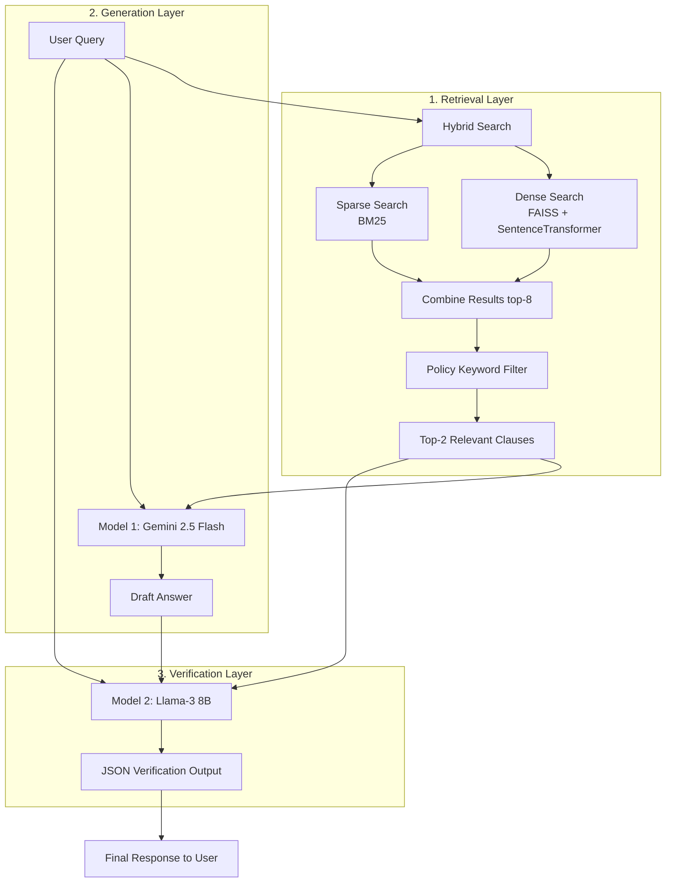

# LIRAG Policy Agent

LIRAG (Layered Retrieval-Augmented Generation) is a policy QA pipeline for government scholarship and education documents.

It supports:
- multi-aspect hybrid retrieval (dense + sparse + rerank)
- evidence-constrained answer generation
- optional second-stage answer verification
- evaluation for retrieval quality, hallucination, attribution, and sentence-level correctness

## 1. End-to-End Flow

Full process from raw PDFs to evaluated answers:

1. Put policy PDFs into `data/raw_policies/`.
2. Extract text from PDFs to `data/processed_clauses/*.txt`.
3. Segment text into clauses and save to `data/clauses.json`.
4. Build retrieval indexes:
	 - sparse + dense under `data/index/` (from `data/clauses.json`)
	 - dense index under `data/processed_clauses/dense_index` (from `data/processed_clauses/clauses.json`)
5. Run the policy agent.
6. Run evaluations.

Important:
- Runtime retrieval in `src/agent.py` currently uses `data/processed_clauses/clauses.json` and `data/processed_clauses/dense_index` via `dense_search.py` and `sparse_search.py`.
- `build_index.py` builds `data/index/*` from `data/clauses.json`.
- Keep these datasets synchronized after rebuilds.

## 2. System Architecture

The pipeline follows a robust 3-stage process: **Retrieval → Generation → Verification**. 



### What Does Each Model Do?

The system utilizes three distinct AI models, each with a specialized role:

**Model 1: The Retriever (`BAAI/bge-base-en-v1.5`)**
*   **Provider:** HuggingFace / SentenceTransformers
*   **Role:** Converts text into numerical vectors (embeddings).
*   **Function:** It powers the "Dense Search" part of the retrieval layer. When a user asks a question, this model converts the question into a vector and finds the closest matching policy clauses in the FAISS vector database.

**Model 2: The Generator (`gemini-2.5-flash`)**
*   **Provider:** Google Generative AI
*   **Role:** Drafts the initial human-readable answer.
*   **Function:** It takes the user's question and the raw text of the top-2 retrieved policy clauses. It reads the clauses and synthesizes a fluent, natural-language answer based *only* on the provided text.

**Model 3: The Verifier (`llama3-8b-8192`)**
*   **Provider:** Meta (hosted via Groq API)
*   **Role:** Strict auditor and hallucination guardrail.
*   **Function:** It takes the Draft Answer (from Gemini), the Original Clauses, and the Question. It strictly audits Gemini's work. If Gemini hallucinated or included outside information, Llama-3 rewrites the answer to be strictly grounded. It then outputs a structured JSON response containing:
    *   `is_supported`: True/False (Did the clauses actually support the answer?)
    *   `verified_answer`: The final, safe string to show the user.
    *   `evidence_clauses`: A specific list of clause IDs that prove the answer.

### How Do We Verify the Answer?

The verification step is the core innovation of this Dual-LLM setup. It solves the common RAG problem of "hallucinations" (where an LLM makes up an answer when the document doesn't contain it).

1.  **Prompt Engineering:** The Llama-3 model is given a highly restrictive system prompt (`verification_prompt.txt`). It is told it is a "strict policy auditor".
2.  **Cross-Examination:** It compares the Draft Answer against the Provided Clauses word-for-word. 
3.  **JSON Structuring:** By forcing Llama-3 to output in strict JSON format, the Python code (`agent.py`) can programmatically parse exactly which clause IDs were used and whether the answer is mathematically flagged as `Supported: True` or `Supported: False`.
4.  **Final Safeguard:** The user only ever sees the `verified_answer` generated by Llama-3, ensuring the output has passed the audit.

## 3. Project Layout

Main folders and scripts:

- `src/preprocessing/`
	- `pdf_to_text.py`: PDF to text extraction
	- `text_to_clauses.py`: convert text into numbered clauses
- `src/retrieval/`
	- `build_index.py`: build FAISS + BM25 in `data/index/`
	- `dense_index.py`: build dense index in `data/processed_clauses/dense_index`
	- `hybrid_search.py`: dense+sparse fusion, aspect coverage, reranking
	- `dense_search.py`, `sparse_search.py`: retrieval backends
- `src/generation/`
	- `generate_answer.py`: extraction baseline (with optional LLM fallback path)
	- `generate_answer_llm.py`: evidence-constrained LLM answer generation
- `src/verification/`
	- `verify_policy_answer.py`: second LLM verification (support + attribution checks)
- `src/agent.py`
	- main pipeline entrypoint (`policy_agent`)
- `evaluation/`
	- `evaluation.py`: retrieval/hallucination/attribution metrics
	- `sentence_evaluation.py`: sentence-level keyword evaluation
	- `check_second_llm_necessity.py`: verify when second LLM is needed

## 4. Requirements

Recommended:
- Python 3.10 or 3.11
- pip
- Internet access for first-time model/API usage

Install dependencies:

```powershell
pip install -r requirements.txt
pip install scikit-learn
```

Why `scikit-learn`:
- `src/generation/generate_answer.py` imports `sklearn.metrics.pairwise.cosine_similarity`.

## 5. Environment Variables

Create a `.env` file in project root:

```env
# Required for LLM generation
GEMINI_API_KEY=your_gemini_api_key

# Required for verification (Groq OpenAI-compatible endpoint)
GROQ_API_KEY=your_groq_api_key

# Optional fallback configuration
OPENAI_API_KEY=your_openai_api_key
```

Notes:
- LIRAG mode (`use_llm=True`) uses Gemini for generation + Groq for verification.
- If LLM calls fail and `llm_only=False`, agent falls back to extraction baseline.

## 6. Quick Start (Use Existing Data)

If indexes and clauses are already prepared:

1. Set your query in `config.py` (`QUERY`).
2. Run:

```powershell
python -m src.agent
```

Expected output includes:
- question
- verified answer
- support status + confidence
- unsupported parts (if any)
- supporting evidence clause IDs

## 7. Full Data Build Process

Run these commands from repository root.

### Step 1: Add PDFs

Copy policy PDFs to:
- `data/raw_policies/`

### Step 2: Extract PDF Text

```powershell
python -m src.preprocessing.pdf_to_text
```

Output:
- one `.txt` per PDF in `data/processed_clauses/`

### Step 3: Build `data/clauses.json` from extracted text

`text_to_clauses.py` appends to `data/clauses.json`. If you want a clean rebuild, remove the old file first.

Clean rebuild (optional):

```powershell
Remove-Item data/clauses.json -ErrorAction SilentlyContinue
```

Then process each text file you want to include:

```powershell
python -m src.preprocessing.text_to_clauses --input data/processed_clauses/NEP_Final_English_0.txt --policy_id NEP_Final_English_0
python -m src.preprocessing.text_to_clauses --input data/processed_clauses/Scholarship_Policy_2022.txt --policy_id Scholarship_Policy_2022
```

Batch example (review selected files first):

```powershell
Get-ChildItem data/processed_clauses -Filter *.txt |
ForEach-Object {
	python -m src.preprocessing.text_to_clauses --input $_.FullName --policy_id $_.BaseName
}
```

### Step 4: Build retrieval indexes

Build FAISS + BM25 from `data/clauses.json`:

```powershell
python -m src.retrieval.build_index
```

Build dense index from `data/processed_clauses/clauses.json`:

```powershell
python -m src.retrieval.dense_index
```

If you rebuilt only `data/clauses.json`, also update `data/processed_clauses/clauses.json` (or vice versa) so runtime and index files stay aligned.

## 8. Running the Agent

### A) Script mode (default in `src/agent.py`)

```powershell
python -m src.agent
```

### B) Programmatic mode

```python
from src.agent import policy_agent

query = "What is the income limit to apply for post-matric scholarship?"
answer, clauses = policy_agent(query, use_llm=True, use_baseline=False)

print(answer)
```

Key flags in `policy_agent`:
- `use_llm=True`: LIRAG mode (generation + verification)
- `use_baseline=True`: dense-only retrieval baseline
- `llm_only=True`: fail fast if LLM call fails (no fallback)

## 9. Evaluation

### A) Main evaluation (precision/recall/hallucination/attribution)

```powershell
python -m evaluation.evaluation --test_file evaluation/test_queries.json
```

### B) Sentence-level evaluation

```powershell
python -m evaluation.sentence_evaluation
```

Uses:
- `evaluation/test_queries_sentence.json`

### C) Check second LLM necessity

```powershell
python -m evaluation.check_second_llm_necessity --test-file evaluation/test_queries.json
```

## 10. Configuration

Main config file:
- `config.py`

Useful variables:
- `QUERY`
- `ALTERNATIVE_QUERIES`
- `RETRIEVAL_TOP_K`
- `POLICY_FILTER_TOP_K`
- `SENTENCE_TRANSFORMER_MODEL`
- `USE_LLM_VERIFICATION`
- `USE_BASELINE`

## 11. Troubleshooting

### Issue: sentence-transformers model not found

Cause:
- several loaders use `local_files_only=True`

Fix:
- run once with internet and ensure model cache is available
- or adjust loaders if you want online download behavior

### Issue: empty or weak answers

Checklist:
- verify `data/processed_clauses/clauses.json` has valid clauses
- ensure index files match the same clause dataset
- inspect clause IDs and text quality for segmentation errors

### Issue: LLM errors (quota/rate/API)

Behavior:
- with `llm_only=False`, agent falls back to extraction baseline
- with `llm_only=True`, agent raises error

### Issue: duplicate clauses over repeated runs

Cause:
- `text_to_clauses.py` appends to `data/clauses.json`

Fix:
- delete `data/clauses.json` before rebuilding from scratch

## 12. Recommended Rebuild Checklist

When adding or changing policy documents:

1. Extract new PDF text.
2. Regenerate clauses (clean rebuild preferred).
3. Rebuild indexes.
4. Confirm runtime clause file and index are synchronized.
5. Run sample agent queries.
6. Run evaluation scripts.

## 13. License and Usage

Use this repository for research/prototyping unless your project policy states otherwise.
Verify policy interpretations manually before production use.